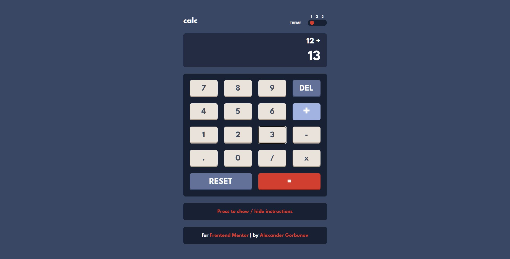
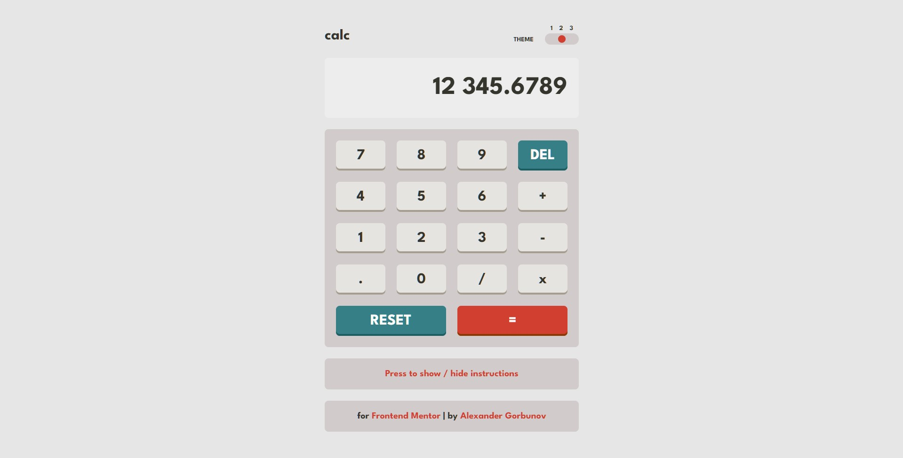
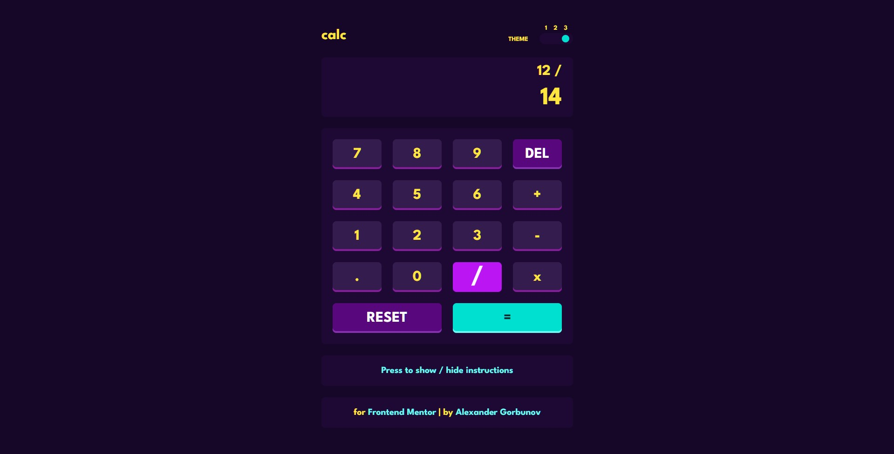
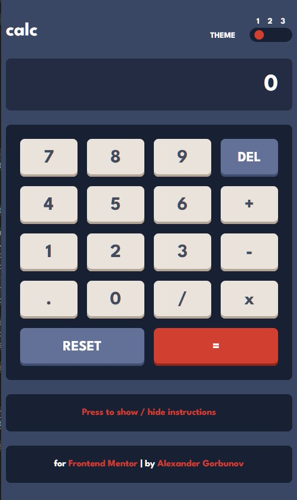
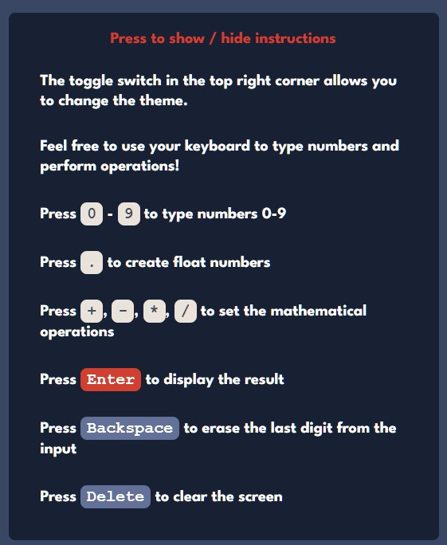

<h1 align="center">Calculator App</h1>
<p align="center">
 Coded with <code>HTML</code>, <code>SCSS</code>, <code>JavaScript</code>
</p>

<p align="center">
  
</p>

<p align="center">
  
</p>

<p align="center">
  
</p>

<p align="center">
  
  
</p>

## ℹ️ About

This is a solution to the [Calculator app challenge on Frontend Mentor](https://www.frontendmentor.io/challenges/calculator-app-9lteq5N29).

See [Task.md](./docs/task.md) for more details about the task.

Users should be able to:

- See the size of the elements adjust based on their device's screen size
- Perform mathmatical operations like addition, subtraction, multiplication, and division
- Adjust the color theme based on their preference
- **Bonus**: Have their initial theme preference checked using `prefers-color-scheme` and have any additional changes saved in the browser

## ⚙️ Tools

- **HTML5**
  - Semantic HTML
- **SASS**
  - Flexbox
  - Grid
  - Responsive design
  - Desktop first
- **JavaScript**
  - JSDoc - just describe what functions do with JSDoc styled comments
- **Github Pages** - for hosting
- **VS Code**
  - _Live Server_ - VS Code extension that launches local servers
  - _Live Sass Complier_ - VS Code extension that transpiles SCSS/SASS files in CSS

## 📁 File Structure

<table>
  <tr>
    <th>Path</th>
    <th>Description</th>
  </tr>
  <tr>
    <td>public</td>
    <td>Folder with <code>.html</code> and <code>.css</code> files</td>
  </tr>
  <tr>
    <td>public / index.html</td>
    <td>Main HTML file</td>
  </tr>
  <tr>
    <td>public / index.css</td>
    <td>Main CSS file, generated with SCSS transpiler</td>
  </tr>
  <tr>
    <td>public / index.css.map</td>
    <td>Generated with SCSS transpiler, might be used for debugging, i guess</td>
  </tr>
  <tr>
    <td colspan="2"></td>
  </tr>
  <tr>
    <td>src</td>
    <td>Source files needed for application development</td>
  </tr>
  <tr>
    <td>src / assets</td>
    <td>Images and other media used on the webpage</td>
  </tr>
  <tr>
    <td>src / index.scss</td>
    <td>Main SCSS file, used to later generate CSS</td>
  </tr>
  <tr>
    <td>src / styles</td>
    <td>Folder with SCSS partials, imported by <code>index.scss</code></td>
  </tr>
  <tr>
    <td>src / index.js</td>
    <td>Main file with JS</td>
  </tr>
  <tr>
    <td>src / scripts</td>
    <td>Folder with JS functions imported by <code>index.js</code></td>
  </tr>
  <tr>
    <td colspan="2"></td>
  </tr>
  <tr>
    <td>docs</td>
    <td>Folder with additional information, documentation</td>
  </tr>
  <tr>
    <td>docs / images</td>
    <td>Folder with the application screenshots</td>
  </tr>
  <tr>
    <td>docs / images / goals</td>
    <td>Folder with images from Frontendmentor that show how the page should look like</td>
  </tr>
  <tr>
    <td>docs / images / results</td>
    <td>Folder with screenshots of how the application works after being fully developed</td>
  </tr>
  <tr>
    <td>docs / README-template.md</td>
    <td>Template for README.md, don't use it (from FrontendMentor)</td>
  </tr>
  <tr>
    <td>docs / style-guide.md</td>
    <td>Style information: color palette, fonts, etc. (from FrontendMentor)</td>
  </tr>
  <tr>
    <td>docs / task.md</td>
    <td>Detailed task description (from FrontendMentor)</td>
  </tr>
  
</table>

## 💡 Details

### My first project with `JavaScript`

I've been studying JS for the entire August 2022 3-4 hours per day from Monday to Sunday. By the start of the September 2022 I decided to code something challenging. The result is successful. The hardest part was to design the calculator logic. Learnt many things during the process of coding the logic, enjoyed it _mostly_.

<hr>

### Theme switcher

Smooth, animated transition between 3 themes. A [video](https://www.youtube.com/watch?v=RiWxhm5ZdFM&t=1s&ab_channel=WebDevSimplified) from WebDev Simplified YouTube channel helped a lot to understand how it works.

Basically I just set the default variables for colors in `body` selector in CSS, then redefine this variables in separate classes. Then bind with JS class addition and removal from `<body>`.

Made toggle switch with a simple range `<input>`. Styled it using [this article](https://www.w3schools.com/howto/howto_js_rangeslider.asp) from W3C. Also added animation on hover - the ball smoothly shrinks on hover, changes its color. Couldn't find a way to animate transition between value, although unsure if that's needed.

<details><summary><em>HTML code for the switcher</em></summary>

```HTML
<input name="switcher" id="switcher" type="range" min="1" max="3" value="1" />
```

</details>

<details><summary><em>SCSS for selectors used to create themes</em></summary>

```SCSS
body {
  --page-background-color: hsl(222, 26%, 31%);
  --keypad-background-color: hsl(224, 36%, 15%);

  --switcher-background-color: hsl(224, 36%, 15%);
  --switcher-text-color: white;

  // ...
}

.theme-1 {
  --page-background-color: hsl(0, 0%, 90%);
  --keypad-background-color: hsl(0, 5%, 81%);

  --switcher-background-color: hsl(0, 5%, 81%);
  --switcher-text-color: hsl(60, 10%, 19%);

  // ...
}

.theme-2 {
  --page-background-color: hsl(268, 75%, 9%);
  --keypad-background-color: hsl(268, 71%, 12%);

  --switcher-background-color: hsl(268, 71%, 12%);
  --switcher-text-color: hsl(52, 100%, 62%);

  // ...
}
```

</details>

<details><summary><em>SCSS for the switcher</em></summary>

```SCSS
#switcher {
  appearance: none;
  width: 4.5rem; // 72px
  height: 1.5rem; // 24px
  background: var(--switcher-background-color);
  outline: none;
  transition: 0.3s;
  border-radius: 1rem;
  padding: 0.5rem;
  cursor: pointer;

  // Yeah, they share the same styles, but
  // "selector 1, selector 2" just doesn't properly work in this case
  @mixin slider {
    width: 1rem;
    height: 1rem;
    background: var(--button-accent-background-color);
    border-radius: 1rem;
    transition: 0.3s;
  }

  &::-webkit-slider-thumb {
    @include slider;
    appearance: none;
  }

  &::-moz-range-thumb {
    @include slider;
  }

  &:hover::-webkit-slider-thumb {
    background: var(--button-accent-background-hover);
    transform: scale(0.85);
  }

  &:hover::-moz-range-thumb {
    background: var(--button-accent-background-hover);
    transform: scale(0.85);
  }
}
```

</details>

<details><summary><em>Switcher logic in JS</em></summary>

```JavaScript
// index.js

import { switcherHandler } from "./scripts/switcher.js";
document.querySelector("#switcher").addEventListener("change", switcherHandler);
```

```JavaScript
// switcher.js

const switcherElement = document.querySelector("#switcher");
const themes = ["theme-1", "theme-2"];
/**
 * Changes the page theme depending on value of range input.
 * In order to change the theme the code adds or removes specific classes from `body` tag.
 *
 * @return {undefined} `undefined`
 */
export function switcherHandler() {
  document.body.classList.remove(...themes);
  switch (+switcherElement.value) {
    case 1: // default theme
      break;
    case 2:
      document.body.classList.add(themes[0]);
      break;
    case 3:
      document.body.classList.add(themes[1]);
      break;
    default:
      break;
  }
  return;
}
```

</details>

<hr>

### Figma prototype

I use a free version of FrontendMentor. Thus I don't have access to Figma prototypes. But that's not a problem - I made my own one

Here it is: https://www.figma.com/file/HXUvWZAAVbKjeRxZtV97FT/Calculator-App?node-id=0%3A1

That helped me to make the calculator as close to the photos as possible

<hr>

### Press keys on the keyboard = Press buttons on the screen

I bound pressing keys and pressing buttons

<details><summary><em>JS code</em></summary>

```JS
// index.js

import { pressButtonHandler } from "./scripts/pressButtons.js";
document.addEventListener("keydown", pressButtonHandler);
```

```JS
// pressButtons.js

export function pressButtonHandler(e) {
  e.preventDefault(); // Otherwise pressing 'Enter' launches 2 events in a row
  switch (e.key) {
    // 1-ST ROW
    case "7":
      launchEventFromKeyboard("#num-7");
      break;
    case "8":
      launchEventFromKeyboard("#num-8");
      break;
    case "9":
      launchEventFromKeyboard("#num-9");
      break;
    case "Backspace":
      launchEventFromKeyboard("#del");
      break;

    // 2-ND ROW
    case "4":
      launchEventFromKeyboard("#num-4");
      break;
    case "5":
      launchEventFromKeyboard("#num-5");
      break;
    case "6":
      launchEventFromKeyboard("#num-6");
      break;
    case "+":
      launchEventFromKeyboard("#plus");
      break;

    // 3-RD ROW
    case "1":
      launchEventFromKeyboard("#num-1");
      break;
    case "2":
      launchEventFromKeyboard("#num-2");
      break;
    case "3":
      launchEventFromKeyboard("#num-3");
      break;
    case "-":
      launchEventFromKeyboard("#minus");
      break;

    // 4-TH ROW
    case ",":
    case ".":
      launchEventFromKeyboard("#dot");
      break;
    case "0":
      launchEventFromKeyboard("#num-0");
      break;
    case "/":
      launchEventFromKeyboard("#divide");
      break;
    case "x":
    case "*":
      launchEventFromKeyboard("#times");
      break;

    // 5-TH ROW
    case "Delete":
      launchEventFromKeyboard("#reset");
      break;
    case "=":
      // case "Enter":
      launchEventFromKeyboard("#equals");
      break;
    case "Enter":
      launchEventFromKeyboard("#equals");
      break;
  }
  return;
}
```

</details>

<hr>

### Calculator logic

That's the most complex part, that probably requires length explanation... Although I'd rather recommend to read the code. I supplied it with comments. _good luck_

The logic is described mainly in `index.js`, `stackOperation.js`

<hr>

### JS Doc

Used JS Doc notation (that is supported by VS Code by default) to explain how each function works.

Here are some examples:

<details><summary><em>Format number</em></summary>

```js
/**
 * Divides the integer in groups of three and adds space between group.
 * Adds space after "-".
 * Example: `-12312.123123` -> `- 12 312.123123`.
 * Made to give the numbers a fancier look.
 *
 * @param {number | string} inputNumber
 * @return {string} The formatted number
 */
export function numberWithDelimeters(inputNumber) {
  let parts = inputNumber.toString().split(".");
  parts[0] = parts[0].replace(/\B(?=(\d{3})+(?!\d))/g, " ");
  parts[0] = parts[0].replace("-", "- ");
  return parts.join(".");
}
```

</details>

<details><summary><em>Highlight operations</em></summary>

```js
/**
 * Highlights the element, removes highlight from previously higlighted element (if any)
 * Selector for the highlighted element is stored in a const external array
 * Highlight means to add a class with styles to that element
 *
 * @param {string} elementSelector - CSS selector of the element to be highlighted
 * @return {undefined} undefined
 */
export function hightlightElement(elementSelector) {
  if (highlightedElement.length > 0) {
    document
      .querySelector(highlightedElement.pop())
      .classList.remove("highlight");
  }
  highlightedElement.push(elementSelector);
  document.querySelector(elementSelector).classList.add("highlight");
  return;
}
```

```js
/**
 * Removes highlight from the element with selector saved in a const external array
 *
 * @return {undefined} undefined
 */
export function removeHighlightFromElement() {
  if (highlightedElement.length === 0) return;
  document
    .querySelector(highlightedElement.pop())
    .classList.remove("highlight");
  return;
}
```

</details>

<hr>

### SASS

This time made just 2 files: `index.scss`, `_globals.scss`. Nesting of CSS selectors helps a lot! Decided not to use BEM this time. Didn't see much difference. HTML looks cleaner, but I faced some issues because of using id in HTML tags.

## 🔗 Useful resources

- [Light, Dark theme : Web Dev Simplified](https://www.youtube.com/watch?v=RiWxhm5ZdFM&t=1s&ab_channel=WebDevSimplified)
- [Custom range input sliders : W3C](https://www.w3schools.com/howto/howto_js_rangeslider.asp)
- [How to add transition to details tag : Stack Overflow](https://stackoverflow.com/questions/38213329/how-to-add-css3-transition-with-html5-details-summary-tag-reveal)
- [How to format a number so it contained a delimiter after every 3 digits : Stack Overflow](https://stackoverflow.com/questions/2901102/how-to-print-a-number-with-commas-as-thousands-separators-in-javascript)
- [Live server : VS Code extension](https://marketplace.visualstudio.com/items?itemName=ritwickdey.LiveServer)
- [Live SASS Complier : VS Code extension](https://marketplace.visualstudio.com/items?itemName=ritwickdey.live-sass)

## 👤 Author

- Frontend Mentor - [@GrbnvAlex](https://www.frontendmentor.io/profile/GrbnvAlex)
- Telegram - [@Arlagonix](https://t.me/Arlagonix)
- Github - [@arlagonix](https://github.com/arlagonix)
